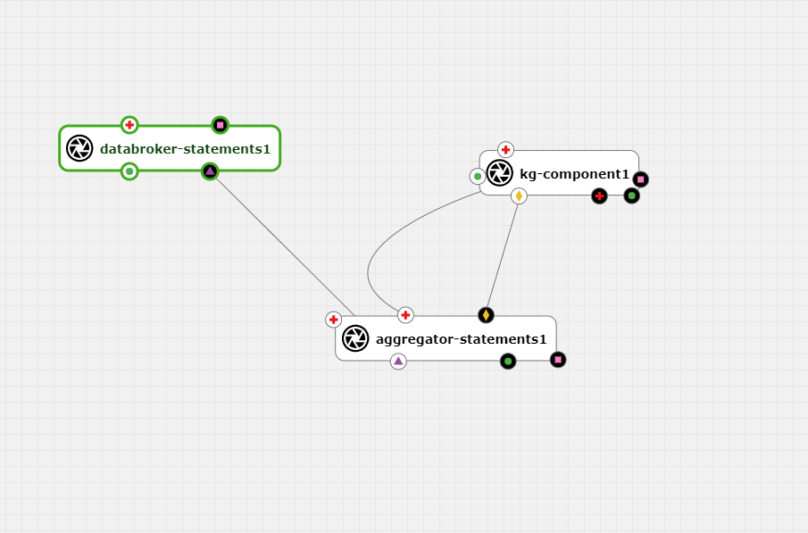
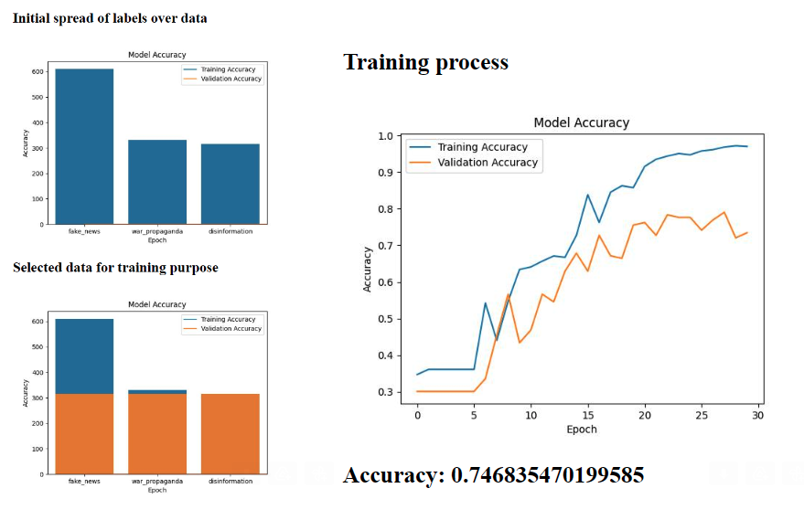

# MindBugs Discovery project adapted for AI4Experiments platform

This project was created during AI4Media Open Call under the challenge C1-A: Realising a hybrid AI application in AI4EU experiments

All the code can be found on our github repo: https://github.com/cheresioana/ai4media 
Learn more about our project on our official page: https://discovery.mindbugs.ro/  

## General description

The Mindbugs project is all about analyzing the universe of disinformation so that it may be studied and understood. Our deployment on AI4Experiments platform allows us to share more of our work with the AI community. 

 

The pipeline begins with a DataBroker, responsible for collecting structured data containing "statement" and "label" information. This dataset then moves to the Aggregator component, which plays a role in processing the data.

The Aggregator serves a dual purpose. It not only trains a classifier but also extracts relevant keywords from a variety of statements, making the data more informative.

The next player in this sequence is the Knowledge Graph (KG) component. Leveraging the Aggregator's expertise, the KG component analyzes and classifies statements. It also searches its disinformation graph to find the closest match to the analyzed statement.

Using the Louvain algorithm, the KG component identifies and highlights the disinformation community associated with the analyzed statement. This step provides valuable insights into the relationships and associations within the disinformation landscape.

## DataBroker 

The data broker component serves as a source of information, providing details about deceptive statements and their associated labels. It's designed in a way that allows it to be seamlessly replaced by any other component with a similar functionality.

It's important to note that all the data provided by the published data broker has been collaboratively generated with Veridica. This dataset comprises 630 instances of deceptive statements, each thoughtfully labeled. It's essential to emphasize that the use of this data is not intended for profit or commercial purposes without obtaining explicit consent from Veridica (https://www.veridica.ro/).

## Aggregator

 

The Aggregator component plays a dual role in our system by training a classifier capable of labeling various types of disinformation statements. In our dataset, the labels encompass categories such as "fake news," "war propaganda," and "disinformation."

What makes the Aggregator component particularly versatile is its ability to adapt to new data formats. When presented with data structured in the same "statement" and "label" format, it undergoes automatic retraining. This process involves updating the model with the newly provided labels, ensuring its adaptability to evolving information.

Moreover, the Aggregator component has an additional feature—it employs Named-Entity Recognition (NER) to extract entities from the statements it processes. This enhances the richness of the data and facilitates deeper analysis.

Should there be a need to initiate a retraining process manually, the component offers a straightforward "/retrain" endpoint, accessible in the deployed environment.

For data validation and assurance, the "/data" endpoint provides a means to verify the correct acquisition of data from the data broker, ensuring that the essential data transfer has occurred seamlessly.

