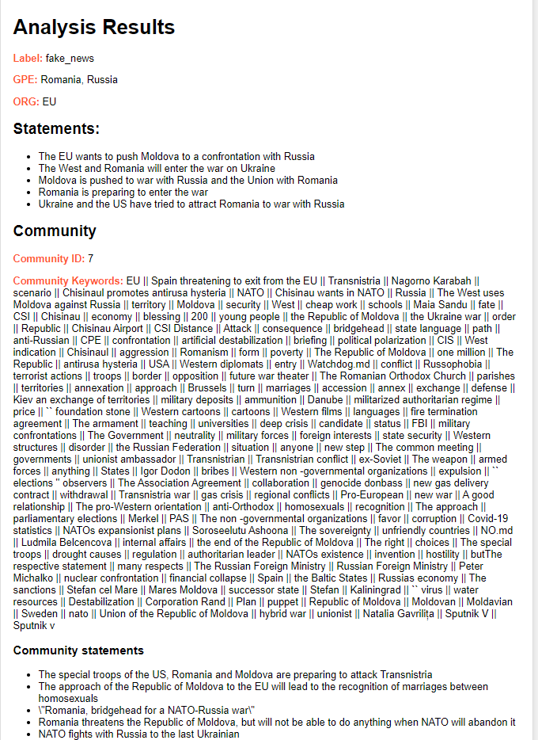
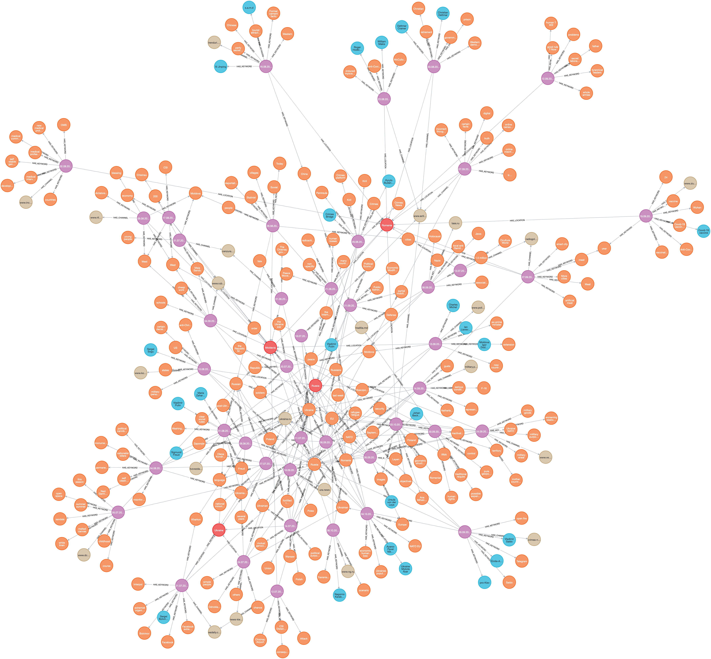

# MindBugs Discovery project adapted for AI4Experiments platform

This project was created during AI4Media Open Call under the challenge C1-A: Realising a hybrid AI application in AI4EU experiments

All the code can be found on our github repo: https://github.com/cheresioana/ai4media 

Learn more about our project on our official page: https://discovery.mindbugs.ro/  

## General description

The Mindbugs project is all about analyzing the universe of disinformation so that it may be studied and understood. Our deployment on AI4Experiments platform allows us to share more of our work with the AI community. 

 

The pipeline begins with a DataBroker, responsible for collecting structured data containing "statement" and "label" information. This dataset then moves to the Aggregator component, which plays a role in processing the data.

The Aggregator serves a dual purpose. It not only trains a classifier but also extracts relevant keywords from a variety of statements, making the data more informative.

The next player in this sequence is the Knowledge Graph (KG) component. Leveraging the Aggregator's expertise, the KG component analyzes and classifies statements. It also searches its disinformation graph to find the closest match to the analyzed statement.

Using the Louvain algorithm, the KG component identifies and highlights the disinformation community associated with the analyzed statement. This step provides valuable insights into the relationships and associations within the disinformation landscape.

## DataBroker 

The data broker component serves as a source of information, providing details about deceptive statements and their associated labels. It's designed in a way that allows it to be seamlessly replaced by any other component with a similar functionality.

It's important to note that all the data provided by the published data broker has been collaboratively generated with Veridica. This dataset comprises 630 instances of deceptive statements, each thoughtfully labeled. It's essential to emphasize that the use of this data is not intended for profit or commercial purposes without obtaining explicit consent from Veridica (https://www.veridica.ro/).

## Aggregator

 

The Aggregator component plays a dual role in our system by training a classifier capable of labeling various types of disinformation statements. In our dataset, the labels encompass categories such as "fake news," "war propaganda," and "disinformation."

What makes the Aggregator component particularly versatile is its ability to adapt to new data formats. When presented with data structured in the same "statement" and "label" format, it undergoes automatic retraining. This process involves updating the model with the newly provided labels, ensuring its adaptability to evolving information.

Moreover, the Aggregator component has an additional feature—it employs Named-Entity Recognition (NER) to extract entities from the statements it processes. This enhances the richness of the data and facilitates deeper analysis.

Should there be a need to initiate a retraining process manually, the component offers a straightforward "/retrain" endpoint, accessible in the deployed environment.

For data validation and assurance, the "/data" endpoint provides a means to verify the correct acquisition of data from the data broker, ensuring that the essential data transfer has occurred seamlessly.

## Knowledge graph component

 

The KG component relies on the Aggregator to give labels to its data. Then, it uses OpenAI embeddings to identify the most similar fake statement from its dataset.

Locally, the KG component has a knowledge graph built using Neo4J and then exported as csv. This graph links different fake statements to the words, subjects, and things mentioned in them. This helps find groups of closely related fake statements, like pieces of a puzzle that fit together. It's like when you see news articles about similar topics – they are connected because they talk about the same things. This is done using an algorithm called the Louvain algorithm for community detection inside the knowledge graph.

The algorithm also tells the user which group the statement belongs to, along with the words from that group and other fake statements that are similar. 

## Orchestrator

The Component Orchestrator is a component designed for testing purposes. When using the AI4EU platform, it automatically generates an orchestrator and this component doesn't need deployment. In essence, this orchestrator serves as a handy tool for evaluating and experimenting with different aspects of your project in a controlled, local environment. It allows you to fine-tune and validate the behavior of various components before deploying them to the broader AI4EU platform, ensuring a smooth and robust integration process.

## How MindBugs Discovery pipeline integrates into the AI community

The versatility of this system allows for a range of valuable applications. Each component is designed to operate both independently and as part of a larger ensemble, offering flexibility and adaptability.

Suppose there's a need to work with a different dataset. In that case, it's as straightforward as making a simple change within the DataBroker from the AI4Experiments platform. The Aggregator component seamlessly adjusts to the new data, automatically adapting its training process.

If the goal is to develop a distinct model for enhanced data analysis and improved outcomes, the Aggregator component can be swapped out to accommodate this endeavor.

Similarly, should the focus be on refining the knowledge graph (KG) and its community identification algorithm, only the KG component can be replaced, leaving the other components untouched.

Moreover, the beauty of this system lies in the open availability of seven different combinations. These combinations allow for utilizing just one component, a pair of components, or all three, offering a range of choices to cater to diverse project requirements and objectives. This inherent flexibility is a key feature of the system, enabling users to customize their approach as needed.

## Credits 

We want to express our appreciation to the AI4Experiments and AI4Media communities for their vital support. This project wouldn't have been achievable without their collaboration. Thank you for making it all possible!

The MindBugs Discovery has indirectly received funding from the European Union’s Horizon 2020 research and innovation action programme, via the AI4Media Open Call #2 issued and executed under the AI4Media project (Grant Agreement no. 951911).

  
  

